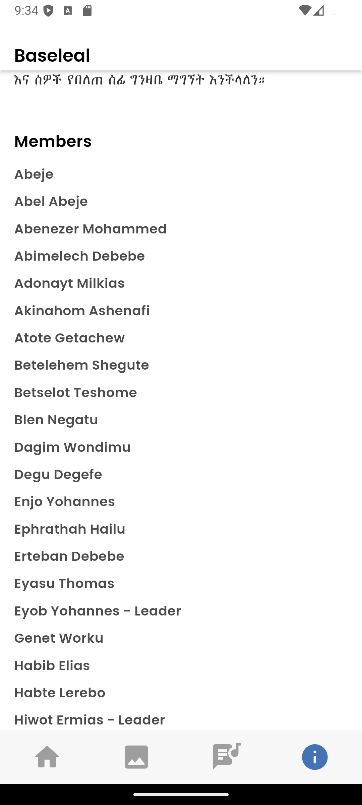

# Baseleal

- is a mobile application designed to enhance the worship experience for Gospel music enthusiasts. It provides a comprehensive platform for accessing mezmure lyrics, viewing a curated gallery of photos and videos, and enjoying a user-friendly interface. With offline access and regular updates, Baseleal ensures that users can stay connected to their favorite Gospel content anytime, anywhere. The app also offers customizable settings to tailor the experience to individual preferences.

## Features

- **Mezmure Lyrics**: Access a collection of Gospel song lyrics used by the choir.
- **Gallery**: View and relive memories through a gallery of photos and videos.
- **User-Friendly Interface**: Simple and intuitive design for easy navigation.
- **Offline Access**: Access lyrics and media without an internet connection.
- **Regular Updates**: Stay up-to-date with new mezmure and gallery additions.
- **Customizable Settings**: Personalize the app to suit your preferences.

# Home Page

# Gallery Page

# Lyrics Page

# About Page

